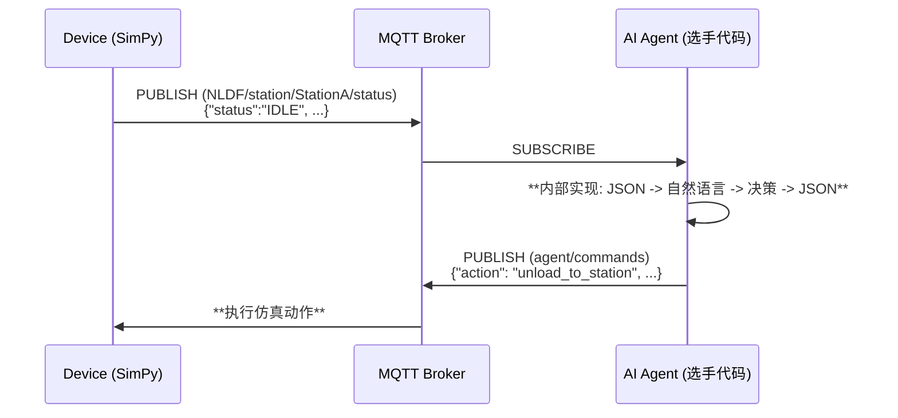

# SUPCON NLDF 自适应产线调度 Agent

## 作品简述
一个用于操作和优化虚拟工厂生产的智能调度系统

## 作品详细描述
愿景：会对话、可以自优化的工厂

看了 SUPCON 的 workshop 之后深受感动，如果工厂能用云原生技术构建，那即使是工业，也可以享受软件技术带来的快速迭代（可能不适用高危化工业，但也足够开始畅想了）。对于重组装的工厂，完全可以像电车一样 OTA 升级，单纯用云上的软件升级来控制控场。即使是化工，也可以畅想先使用一个足够真实的虚拟工厂测试 OTA 升级，像软件一样，跑通所有 dev 环境的测试用例后，推送到生产环境。

> 在这个系统中，机器不再是孤立的执行者，而是能够“对话”的智能体：“我这边快满了，暂停投料。” “收到，我先缓一轮。” 

我们的目标是构建一个智能调度大脑，利用 Agent 技术，让虚拟工厂的生产效率最大化。

### 探索之路：从规则到智能的迭代
我们的开发过程遵循了从简单到复杂、从稳固到智能的演进路径，最终做出了三个版本的调度器：

### V0: 基于低代码平台的 EventFlow 实现
尝试了之后发现在从 Eventflow 发往本地的时候出现问题，认为代码更容易调试，切换成了基于 Python。

### V1.0: 基于规则的调度器 (task_scheduler.py)
实现: 这是我们的起点。我们实现了一个简单但可靠的基于规则的调度方案。该方案为两台 AGV 划分了明确的责任区：AGV1 负责运输左侧产线的物料，AGV2 负责右侧。此版本逻辑清晰、行为可预测，为整个系统打下了稳定的基础。
表现:在基础工况下运行稳定，能够获得约 50分的 KPI。
局限: 灵活性差，无法处理 Product 3 等复杂或动态变化的生产需求（在到达 QC 后运回工作站 B 重新处理），也无法处理QC不过关的情况。是典型的“指令式”而非“自适应”系统。

### V2.0: AI Agent 驱动的调度器 (task_scheduler_ai.py)
- 实现: 这是我们项目的核心创新。我们将调度逻辑升级为 AI Agent 架构。这个 Agent 旨在拥有更全局的视野和更动态的决策能力。它不再依赖僵化的“if-then”规则，目标是根据整个工厂的状态综合判断，动态地为任何可用的 AGV 分配最高优先级的任务。
- 挑战与洞察: 在实现过程中，我们遇到了工业级 Agent 开发中的典型挑战：
   - 状态同步难题: 在长时间运行中，我们观察到 Agent 本地维护的工厂状态与服务端偶尔会出现不一致，导致决策失误。这暴露了在分布式系统中保持状态一致性的重要性，是未来工业 Agent 走向生产环境必须解决的关键问题。
   - supOS 平台探索: 我们最初尝试使用 eventflow 进行消息处理，但在本地调试中遇到了消息路由问题。为了快速推进，我们切换到了更底层的 sourceflow 和 uns namespace，直接处理 MQTT 消息，这加深了我们对 supOS 数据流转机制的理解。
   - 表现: 尽管存在状态管理的 Bug，AI Agent 在运行平稳的阶段（在运行了 10 多次后平均在 400 模拟秒之前），其决策效率和灵活性明显优于规则版，在稳定阶段最高能导 73 分KPI，在约 400 模拟秒后，服务和本地状态不统一且错误高发后，AGV卡住不能工作，KPI逐渐降低到 50 分左右。如果做好状态管理和错误处理，有希望冲击更高的分数。

## 总结与展望
这个项目成功验证了 AI Agent 在工业调度场景中的可行性。我在虚拟环境中简单构建了一个可运行的系统，而且让我通过实践识别了从原型到工业级应用的一些关键（如状态管理、秒级的响应）。

未来还需要提升的地方有：
- 增强 Agent 状态管理: 引入更鲁棒的状态机或校验机制，确保与服务端状态的强一致性。
- 融合 LLM 决策能力: 将 LLM 融入决策环路，让 Agent 能够理解更复杂的自然语言指令（如“优先处理紧急订单”），甚至进行多 Agent 间的协商。现在只能实现单个 Agent 接单，比如让生产线 agent 意识到有新订单，需要让 AGV 取订单。
- 深度利用 supOS: 修复 eventflow 的问题并加以利用，或探索使用 Node-RED 进行更便捷的可视化流程编排。


# 使用到的技术
- 核心语言:  Python + JavaScript
- 仿真环境: Simpy (虚拟工厂核心框架) 和 NodeRED (拖拉拽工作流)
- 通信协议: MQTT + JSON
- 集成平台: supOS-CE
- MQTT Broker: 作为工厂与 Agent 之间的核心消息中枢。
- 数据接口: 使用 uns (Universal Namespace) 和 sourceflow 进行 Topic 定义与消息订阅/发布。
- 探索尝试: eventflow  (用于事件流处理)。

- 过程中使用 Cursor 中的 Kimi-K2-instruct 模型进行编程。


## Quick Start

### 1. Environment Setup

- Download [uv](https://docs.astral.sh/uv/getting-started/installation/)
- 克隆仓库
- 安装依赖

```bash
uv sync
```

### 2. Run Simulation

设置环境变量`TOPIC_ROOT`作为仿真系统 mqtt 的 client id 和 topic root 来分隔不同选手，默认值获取顺序为`TOPIC_ROOT`, `USERNAME`, `USER`的环境变量，否则默认"NLDF_TEST"

- add `--menu` arg to enable interactive input thread for test only
- add `--no-mqtt` arg to disable mqtt communication for debug offline

```bash
uv run run_multi_line_simulation.py (--menu) (--no-mqtt)
```

### Adventure X 比赛专用

1. 先点击 Go Live 启动 Unity 仿真界面
2. 启动任务调度器监听 MQTT broker 的事件发布端口，可选启动基于规则的任务调度器 `task_scheduler.py` 或 Agent 的 `task_scheduler_ai.py`（使用月之暗面的模型 moonshot-v1-8k，需要 MOONSHOT API KEY） 。

```bash
uv run task_scheduler_ai.py
```

或

```bash
uv run task_scheduler.py
```

3. 启动仿真工厂

```bash
uv run run_multi_line_simulation.py (--menu) (--no-mqtt)
```

### 3. Unity Run

1. 设置 `StreamingAssets/MQTTBroker.json`中的 Root_Topic_Head 字段与上述的 topic root 一致，并修改 wss.client_id 字段防止 client 冲突。
2. 使用 VScode Live Server 插件，选中到 index.html 文件后 go live 初始化给予 WebGL 的 Unity 前端界面

   "wss":{
   "port": 8084,
   "host": "supos-ce-instance4.supos.app",
   "client*id": "\*\*\_NLDF2_mqtt_wss_test*\*\*",
   ......
   },

   "common*topic":{
   "Root_Topic_Head": "\*\*\_NLDF1*\*\*"},

## Background

Agent 成了每个领域绕不开的革命火种，在工业领域亦是如此。作为国内工业自动化的龙头企业，我们正在积极尝试将最前沿的 agent 技术引入真实产线，推动传统工厂向自适应、自组织、自优化系统演进。
我们进一步畅想：能否构建一个像人类一样通过语言决策的智能体系统？可以想象机器之间对话：“我这边快满了，暂停投料。”
“收到，我先缓一轮。”用语言做到理解彼此、协作应变、自主决策，实现工厂收益最大化的同时稳定运行。为此，我们搭建了一个可控的模拟工厂，等待你来赋予它思维与行动，探索 agent 与工业协作的新可能。

## 场景解释

工厂内部包含 3 条产线，一个原料仓库以及一个最终产品仓库，3 条产线配置有一样的 A，B，C 工站以及一个质检站，AB，BC，CQ 三条中间连接的自动传送带和 AGV_1，AGV_2 两个 AGV。选手需要对 3 条产线的一共 6 个 AGV 进行操作（包括移动，装货卸货等），选手需要在有限的时间内操作 agv 协调生产，同时应对随机故障，获得尽可能高的 KPI 得分。（KPI 定义见下文）

为了简单起见，每个 AGV 的可移动路径点都使用 P1-P10 来表示，他们表示当前 AGV 路径上的相对可停顿点，如果希望 AGV1 或 2 前往某点例如原料仓库，都需要移动到 P0 点。AGV 路径互不干扰，不考虑碰撞等因素，路径上的点 ID 如图。


| point_id | device_id    | 备注      |
| :------- | :----------- | :-------- |
| P0       | RawMaterial  | 原料仓库  |
| P1       | StationA     | 工站 A    |
| P2       | Conveyor_AB  | 传送带 AB |
| P3       | StationB     | 工站 B    |
| P4       | Conveyor_BC  | 传送带 BC |
| P5       | StationC     | 工站 C    |
| P6       | Conveyor_CQ  | 传送带 CQ |
| P7       | QualityCheck | 质检站    |
| P8       | QualityCheck | 质检站    |
| P9       | Warehouse    | 成品仓库  |

## 游戏机制

游戏使用 simpy 实现离散工厂的仿真

1. Order Generactor: 游戏有一个全局的订单生成器，每个订单中可能有一个或多个产品等待加工，一旦生成对应待加工的 product 会在原料仓库中出现
2. 产品说明： 游戏定义 P1，P2，P3 三种产品，产品 id:prod_1_XXXXXX 中包含 3 部分 prod,type 数字和 UUID，产品有自己对应的工艺流程：

- 产品 P1 / P2

```
RawMaterial → [AGV] → StationA → Conveyor_AB → StationB → Conveyor_BC → StationC → Conveyor_CQ → QualityCheck → [AGV] → Warehouse
```

- 产品 P3

```
RawMaterial → [AGV] → StationA → Conveyor_AB → StationB → Conveyor_BC → StationC → Conveyor_CQ[upper/lower buffer] → [AGV] → StationB → Conveyor_BC → StationC → Conveyor_CQ → QualityCheck → [AGV] → Warehousse
```

3. AGV 动作操控时会消耗电量，在移动前检查如果当前电量不足以完成动作，AGV 会自动返回充电站充电。
4. KPI 指标

| 类别         | 指标         | 计算公式                                      |
| :----------- | :----------- | :-------------------------------------------- |
| **生产效率** | 订单完成率   | `按时完成订单数 / 总订单数 × 100%`            |
|              | 生产周期效率 | `实际生产时间 / 理论生产时间`（含完成率权重） |
|              | 设备利用率   | `设备工作时间 / 总时间 × 100%`                |
| **质量成本** | 一次通过率   | `一次通过质检数 / 总产品数 × 100%`            |
|              | 生产成本     | `Σ(物料+能源+维修+报废成本)`                  |
| **AGV 效率** | 充电策略     | `主动充电次数 / 总充电次数 × 100%`            |
|              | 能源效率     | `完成任务数 / 总充电时间`                     |
|              | AGV 利用率   | `运输时间 / (总时间-故障-充电) × 100%`        |

5. 竞赛评分系统（100 分制）

- **生产效率**（40 分）：订单完成率 16 分 + 周期效率 16 分 + 设备利用率 8 分
- **质量成本**（30 分）：一次通过率 12 分 + 成本控制 18 分
- **AGV 效率**（30 分）：充电策略 9 分 + 能效比 12 分 + 利用率 9 分

## 3. 功能与架构

### 3.1 核心工作流：外部 JSON 接口，内部自然语言驱动

仿真环境与选手 Agent 之间通过结构化的 JSON 消息进行通信，我们要求选手在自己的 Agent 内部构建自然语言处理能力，形成 `JSON -> NL -> JSON` 的完整决策链路。



### 3.2 MQTT 通信层

#### Topic 架构 (`NLDF_DEFAULT` will be replaced by use environment variable `TOPIC_ROOT`)

| Topic                                         | Agent 权限    | 描述                            | 消息格式 (Payload) |
| :-------------------------------------------- | :------------ | :------------------------------ | :----------------- |
| `NLDF_DEFAULT/{line_id}/station/{id}/status`  | **Subscribe** | 订阅所有工站的状态              | JSON (结构化)      |
| `NLDF_DEFAULT/{line_id}/agv/{id}/status`      | **Subscribe** | 订阅所有 AGV 的状态             | JSON (结构化)      |
| `NLDF_DEFAULT/{line_id}/conveyor/{id}/status` | **Subscribe** | 订阅所有传送带的状态            | JSON (结构化)      |
| `NLDF_DEFAULT/warehouse/{id}/status`          | **Subscribe** | 订阅所有仓库的状态              | JSON (结构化)      |
| :---                                          | :---          | :---                            | :---               |
| `NLDF_DEFAULT/{line_id}/alerts`               | **Subscribe** | 订阅所有设备故障警报            | JSON (结构化)      |
| `NLDF_DEFAULT/orders/status`                  | **Subscribe** | 接收新订单信息                  | JSON (结构化)      |
| `NLDF_DEFAULT/kpi/status`                     | **Subscribe** | 订阅 KPI 更新                   | JSON (结构化)      |
| `NLDF_DEFAULT/result/status`                  | **Subscribe** | 订阅结果更新                    | JSON (结构化)      |
| :---                                          | :---          | :---                            | :---               |
| `NLDF_DEFAULT/command/{line_id}`              | **Publish**   | 发布选手 Agent 生成的结构化指令 | JSON (结构见下文)  |
| `NLDF_DEFAULT/response/{line_id}`             | **Subscribe** | 接收选手 Agent 的响应           | JSON（结构见下文） |

选手发往 `NLDF_DEFAULT/command/{line_id}` 的消息**必须**是以下格式的 JSON 字符串：

```json
{
  "command_id": "str (可选字段，用于记录决策过程)",
  "action": "str (必须是支持的动作之一)",
  "target": "str (动作的目标设备ID，可选)",
  "params": {
    "key1": "value1", ...
  }
}
```

系统反馈 `response/{line_id}` 的消息如下：

```json
{
  "timestamp": "float (仿真时间戳)",
  "command_id": "str (来自于选手的command_id)",
  "response": "str (反馈信息)"
}
```

支持的指令 `action` 和所需 `params`，command_id is optional, can be ignored.

| Action       | 描述                                                                               | Target | 示例                                                                                                                                                                                |
| :----------- | :--------------------------------------------------------------------------------- | :----- | :---------------------------------------------------------------------------------------------------------------------------------------------------------------------------------- |
| `move`       | 命令 AGV 移动到指定路径点                                                          | AGV ID | `{'command_id': 'move_688777', 'action': 'move', 'target': 'AGV_1', 'params': {'target_point': 'P1'}}`                                                                              |
| `charge`     | 命令 AGV 主动充电                                                                  | AGV ID | `{'command_id': 'charge_688777', 'action': 'charge', 'target': 'AGV_1', 'params': {'target_level': 70.0}}`(default: 80.0)                                                           |
| `unload`     | 命令 AGV 卸载产品到指定工站                                                        | AGV ID | `{'command_id': 'unload_688777', 'action': 'unload', 'target': 'AGV_2', 'params': {}}`                                                                                              |
| `load`       | 命令 AGV 从指定工站装载产品                                                        | AGV ID | `{'command_id': 'load_688777', 'action': 'load', 'target': 'AGV_1', 'params': {'product_id': 'prod_1_1ee7ce46'}}`(Product ID only can be used in RawMaterial, else will be ignored) |
| 全局 action  | topic 中的 line_id 和 payload 中的 target 字段内容可以忽略，仅为过 schema 格式审核 | 全局   | :---                                                                                                                                                                                |
| `get_result` | 获取当前整个工厂的 KPI 结果                                                        | any    | `{'command_id': 'get_result_688777', 'action': 'get_result', 'target': my factoty', 'params': {}}`                                                                                  |

## 4.评价维度

除了 ADVX 的统一评价维度外，我们将从以下四个方面对你的项目进行等权重评价：

1. **KPI 得分**

   - 这是最直接且客观的评价标准。我们将根据你搭建的 Agent 在预定义 KPI 指标上的表现进行评分。
   - _注意：如果你对虚拟工厂进行了修改，我们会综合考虑这些改动对 KPI 得分的影响。_

2. **LLM Agent 工程能力**

   - 你需要设计或使用一个框架，使 LLM 能够通过 MQTT + JSON 与虚拟工厂高效交互。
   - 我们将重点考察你在上下文管理、状态管理、错误处理等关键机制上的实现。
   - 优雅、健壮的 Agent 工程设计将获得额外加分。

3. **虚拟工厂的改进**

   - 虚拟工厂基于 Simpy 实现，模拟了真实世界的高级排程（Advanced Scheduling）问题。
   - 如果你发现工厂存在不合理之处，可以直接修改或扩展其运行机制，使其更贴近真实工厂。
   - _如对虚拟工厂有任何修改，请务必在项目 README 中显著注明。_

4. **supOS-CE 开源框架的应用**

   - 成功部署 supOS-CE，并使用其自带的 MQTT Broker 作为虚拟工厂与 Agent 的通信接口，将获得加分。
   - 如果你进一步集成了 supOS-CE 的其他组件（如 NodeRED、Portainer 等），或发现并反馈了其问题/bug，也会获得额外加分。

   - > [supos 选手使用方法](https://ofra65wfwe.feishu.cn/wiki/SRgrwj9LWimsTikRFdzcVvlDnEU)

---
